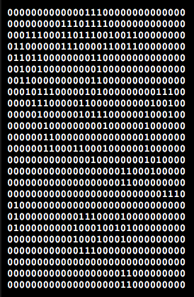
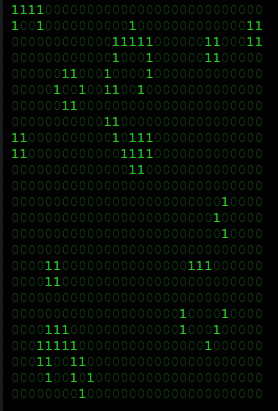

# damionjunk.cgolca

[Conway's Game of Life](https://en.wikipedia.org/wiki/Conway's_Game_of_Life) in
ClojureScript.

## Usage

I wrote this to get back up to speed with the *state of the art* with REPL'ing
and ClojureScript. I also wanted to abuse [OM](https://github.com/omcljs/om) a little so I could use it in
future projects as well.

Here are some screen shots of the two different render modes of the ASCII Game of Life:



The above image is just the `0`'s and `1`'s thrown into a `<pre>` tag. That was
too easy, so just to play a bit more with OM, I wanted the zeros to be dark green
and the ones to be bright green:



Much more pretty!

There is a comment block that has some of my REPL explorations.
If you get this up and running locally, you can change the render type by
swapping:

```clojure
;; Change to colored!
(swap! master-board assoc :render :html)
;; Change back to un-colored.
(swap! master-board assoc :render :pre)


;; You'll want it to stop. It's quite CPU hungry.
(swap! master-board assoc :render nil)


;; If you want to start the render loop back up:
(swap! master-board assoc :render :html)
(render-loop)
```


## License

Copyright © 2015 Damion Junk

Distributed under the Eclipse Public License either version 1.0 or (at
your option) any later version.
